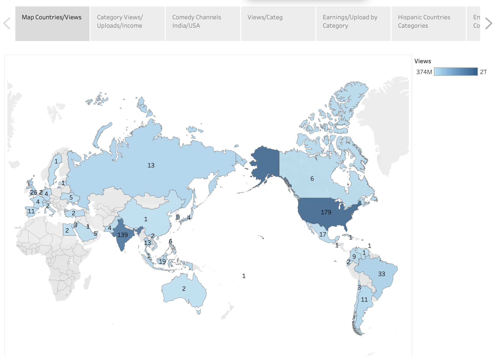
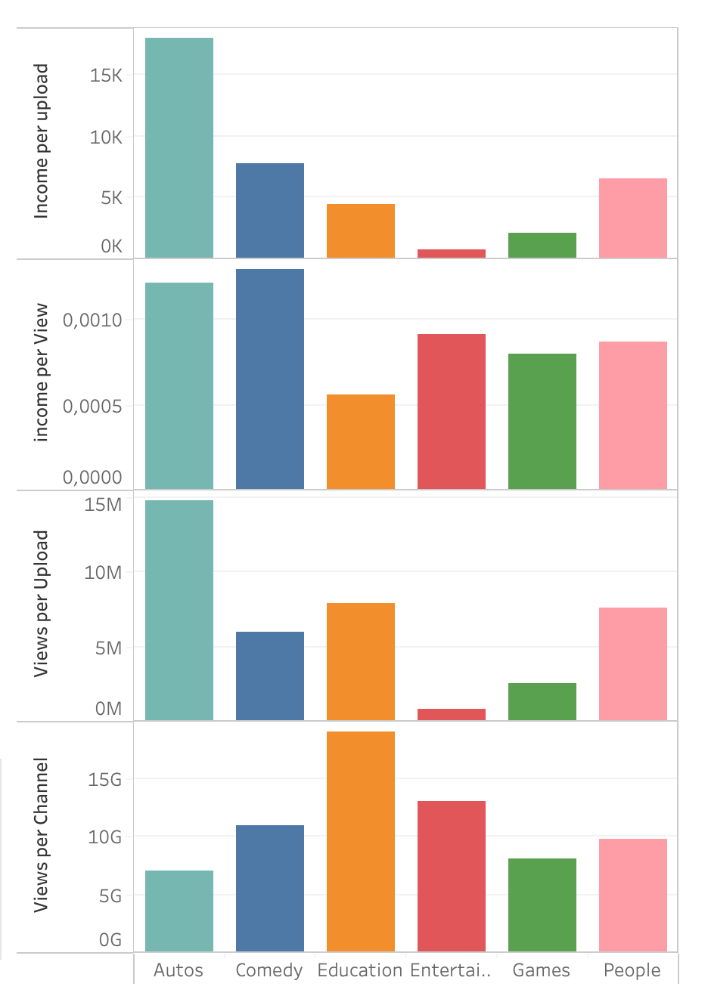
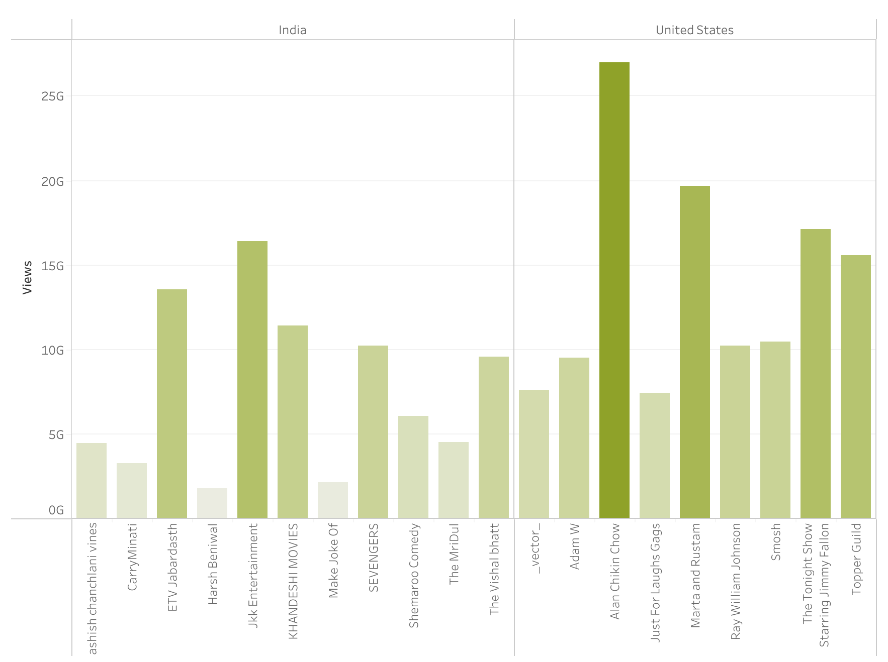
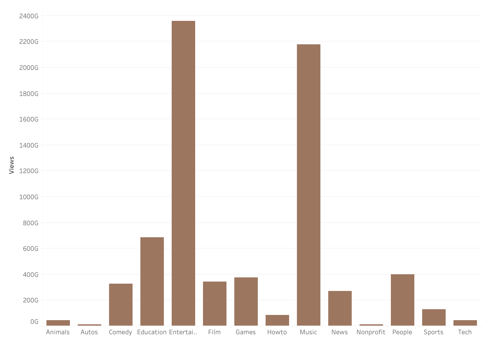
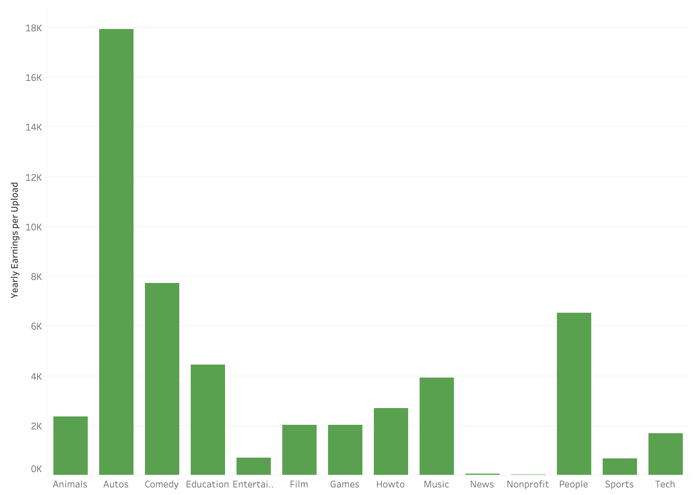
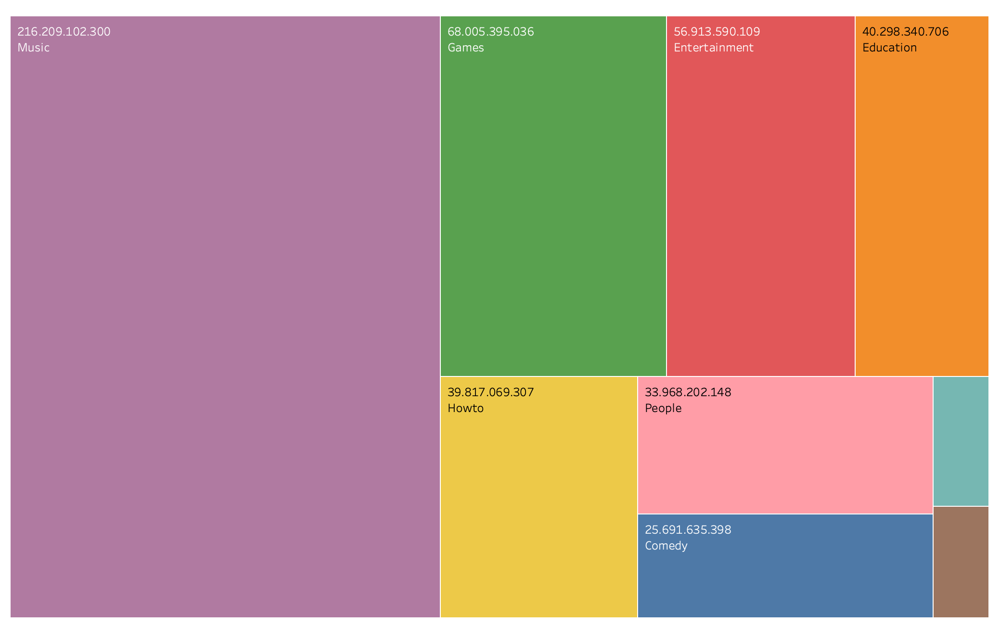
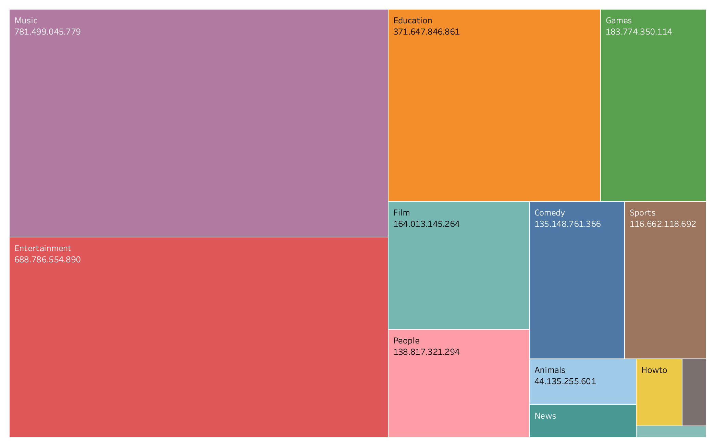

# Youtube_Data_Analisis

https://public.tableau.com/app/profile/ibai.gallego/viz/YoutubeAnalytics_16919546742870/Historia1?publish=yes

## Premise:

We wan´t to know the type of channel most likely to success in todays youtube panorama.

## History Tableau:

### Plot 1:

On this first page we can see the overall distribution of channels by country. We can see the number of channels we have for each country in our database and the colour of the country represents the total number of youtube views per country.

We can see that USA an India are the best places to put our channel. It may be possible that the ammount of channels erives in competition.

### Plot 2:

We can see some relevant data about the most popular types of channels (category)

Comedy has the most inncome per visualization. Automobile channels have a very powerfull views and income per upload an very good income per view.

These two are equally matched toguether epening on what your looking for. A comedy channel will have overall more flow of viewers than auto and even through it has less income per upload, it appears that the comedy channel has more videos with less views but more income per view whereas auto channels have more views and less vieos.

### Plot 3:

Here are the top Indian vs American top channels

By looking at this graph we can see that if we were to choose comedy as a channel USA works best.

### Plot 4:

This plot shows the overall views per category

Entertainment,Music and Education are the most viewed categories. 

### Plot 5:

Yearly earnings per upload by category

Suddenly the work neeed for each category becomes clear that Autos, People, Comedy and Education have the best return per upload.

### Plot 6:

The spanish comunity distribution of categories

Music is by far the strongest followed by games and entertainment

### Plot 7:

English community category distribution

Music and entertainment with education.

## Conclusions:

Overall we have seen how goos automobile comedy and education perform better per view. Education has a niche that works surprisingly well in both indian and english communities but the hispanic community doesn´t appear to have an education niche. 

It is safe to say that eucational channels with enough marketing and production value return greatly in youtube. A hispanic educational channel would surely perform very well.

Even though automobile channels don´t seem to be a very popular choice in both of the spanish and english community it has the best return per upload. Now having said this the flow of users in comedy channels outweights the automobile niche when it comes to income per view. Both would be a good choice. Seeing that comey channels are generally more popular (more competition). Automobile could be a safer choice.

